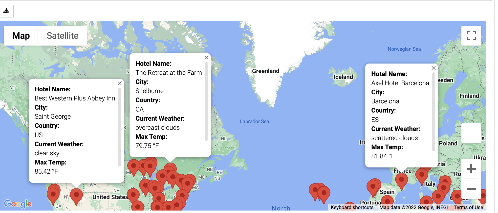
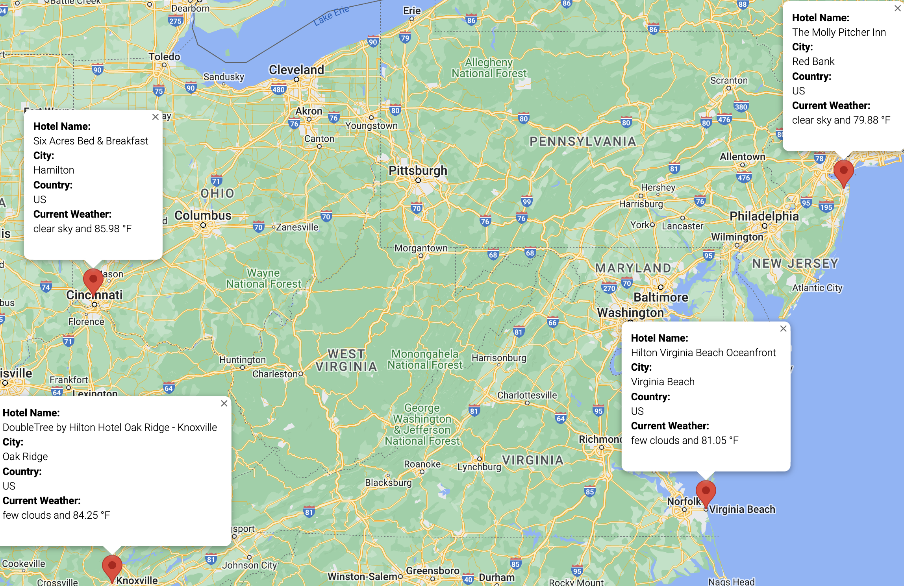
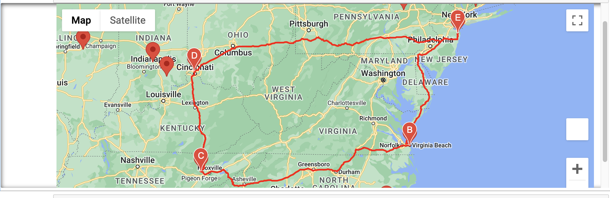

# World_Weather_Analysis

## Overview

The head of a top travel technology company, which specializes in internet related services in the hotel and lodging industry, needed help to collect and present data for customers via the search page. Customers use search to filter based on their preferred travel criteria in order to find their ideal hotel anywhere in the world. The tasks are as follows:
- Use the NumPy module to generate more than 2000 random latitudes and longitudes.
- Use the citipy module to list the nearest city to the latitudes and longitudes.
- Use the OpenWeatherMap API to request the current weather data from each unique city in the list.
- Parse the JSON data from the API request.
- Collect the following data from the JSON file and add it to a DataFrame:
  - City and country
  - Latitude and longitude
  - Maximum temperature
  - Humidity
  - Cloudiness
  - Wind speed
  - Weather Description
- Retrieve customer weather preferences to identify potential travel destinations and nearby hotels. Then, 
- Show the probable destinations on a marker layer map with pop-up markers.
- Use the Google Directions API to create a travel itinerary that shows the route between four cities chosen from the customer’s possible travel destinations. 
- Create a marker layer map with a pop-up marker for each city on the itinerary.

## Resources

- Anaconda3_2022.05
- Conda 4.14.0
- Jupyter Notebook 6.4.8
- Python 3.7.10
- Numpy 1.21.5
- Python Requests 2.27.1
- Jupyter Gmaps 0.8.3
- OpenWeatherMap API
- Google Maps Platform

## Results
- The citipy module identified 742 valid cities around the world for 2000 randomly generated latitude and longitude coordinates.
- The OpenWeatherAPI retrieved weather details for 690 cities out of the 742 cities identified above.
- For the preferred temperatures between 75F and 86F, there were 193 cities with valid hotel information. 
- Some of the destinations identified by Google Maps API for the above given temperature ranges were listed as in the image below:
 

- To create vacation itinerary, four cities in USA were chosen: Red Bank, Virginia Beach, Oak Ridge and Hamilton with start and end location as Red Bank.
 

- Directions API was used to map the directions as shown below:
 
